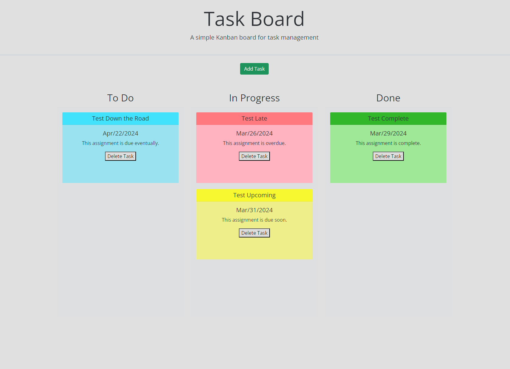

# Task Board Challenge

## Description

This is a project for UW bootcamp in which we were asked to create a task board with draggable/droppable tasks and lanes specifying their progress.

## Installation

N/A

## Usage

On clicking the Add Task button, a modal will pop up for the user to fill out information about the task. When submitted, a card is created with the title, description and due date and placed in the To Do column. The card will be blue if the task is not due for over a week, yellow if it is due within a week, or red if it is overdue. Each card can be dragged between the To Do, In Progress, and Done columns and their state will be saved to local storage. The card will change to green, no matter what the due date, when it is dropped in the Done column. Cards can be deleted with the Delete Task button on each card and will be removed from storage.

Link to deployed application: https://ktunebe.github.io/challenge-05-task-board/

## Credits

## License

N/A